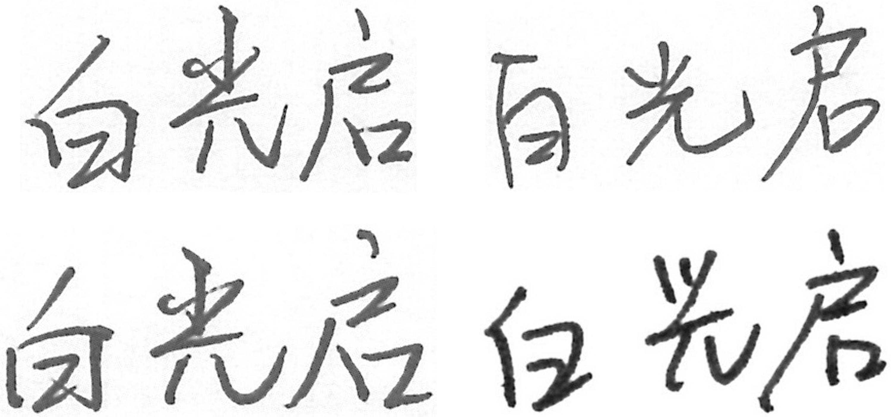
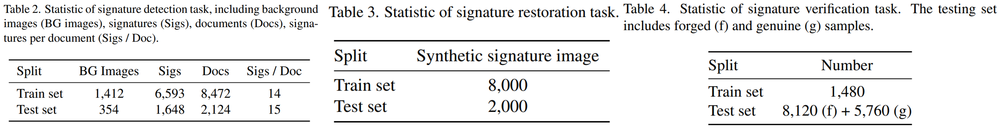
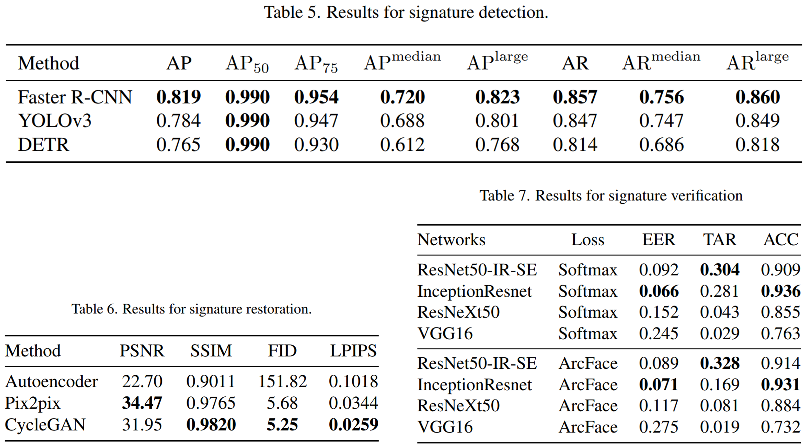

# ChiSig Dataset Release

[Paper Link](https://openaccess.thecvf.com/content/CVPR2022W/SketchDL/papers/Yan_Signature_Detection_Restoration_and_Verification_A_Novel_Chinese_Document_Signature_CVPRW_2022_paper.pdf)

We construct a novel Chinese document offline signature forgery detection benchmark, namely `ChiSig`, which includes all tasks, i.e., signature detection, restoration, and verification.

* Download Link: [https://drive.google.com/file/d/176bG9Hp_uX9bJvIFt437wqAbEqEMqsO7/view?usp=sharing](https://drive.google.com/file/d/176bG9Hp_uX9bJvIFt437wqAbEqEMqsO7/view?usp=sharing)

## Description

Currently, a Chinese signature dataset that can be obtained is [ICDAR 2011 Signature Verification Competition (SigComp2011) - TC11](http://www.iapr-tc11.org/mediawiki/index.php/ICDAR_2011_Signature_Verification_Competition_(SigComp2011)). However, the dataset has limited data, with only 1177 signature images and 20 different names for offline signature verification. Unlike existing datasets, ours has 10,242 images with 500 different signed names.



## Dataset Construction

The dataset consists of clean handwritten signatures, synthesized noisy handwritten signatures, and synthesized documents with handwritten signatures.

We randomly generate 500 names and then let volunteers sign according to certain rules to get the clean signature data, which can be used for signature verification tasks. Then, we obtain scanned documents that can be used to synthesize backgrounds through public resources, such as [XFUND dataset](https://github.com/doc-analysis/XFUND), Chinese National Standards and patents. We randomly place the signatures in the background documents, so that we can obtain data that can be used for signature detection and signature reconstruction.

For the time being, we only publish the signature data that we have obtained, users can obtain the background documents and perform document synthesis by themselves. The mask of the signature image can be obtained by the Otsu's method.

```python
import cv2

# read image as gray scale
image = cv2.imread("data/sign-filter/白光启-20-1.jpg", 0)
blur = cv2.GaussianBlur(image, (5, 5), 0)
# Otsu's method
thresh, binarization = cv2.threshold(
    blur, 0, 255, cv2.THRESH_BINARY + cv2.THRESH_OTSU)
mask = ~binarization
```
The obtained signature image is named in the following format `name-id-number.jpg`, where `name` represents the name signed by volunteer, `id` represents the file id, and `number` represents the number of signatures. For example, if the name `A` is signed by four people, and then each person will sign five times to get a total of 20 samples. If we consider the name `A` signed by each person as a class, We obtained at least four different classes with five samples each class. If a signature image is named with a file id greater than 100, e.g. `id1 > 100`, it means it is a skilled forged one of the signature with file id `id1 − 100`.

We may update our data in the future to improve its diversity



## Benchmark

The dataset includes three benchmarks, detection, restoration, and verification. The selected evaluation methods are all strong baselines and representative methods in the related fields. In addition, the stability and robustness of the selected methods have been verified. Details for each
task are provided in our [paper](https://openaccess.thecvf.com/content/CVPR2022W/SketchDL/papers/Yan_Signature_Detection_Restoration_and_Verification_A_Novel_Chinese_Document_Signature_CVPRW_2022_paper.pdf).




## Citation and Contact

Please consider to cite our paper when you use our dataset. 

**NOTE**: The dataset can only be used for non-commercial purposes!

```
@InProceedings{Yan_2022_CVPR,
    author    = {Yan, Kaihong and Zhang, Ying and Tang, Haoran and Ren, Chengkai and Zhang, Jian and Wang, Gaoang and Wang, Hongwei},
    title     = {Signature Detection, Restoration, and Verification: A Novel Chinese Document Signature Forgery Detection Benchmark},
    booktitle = {Proceedings of the IEEE/CVF Conference on Computer Vision and Pattern Recognition (CVPR) Workshops},
    month     = {June},
    year      = {2022},
    pages     = {5163-5172}
}
```

For any questions about this database please contact the author below.

```
Dr. Jian Zhang
E-mail: jianzhang@intl.zju.edu.cn
```
